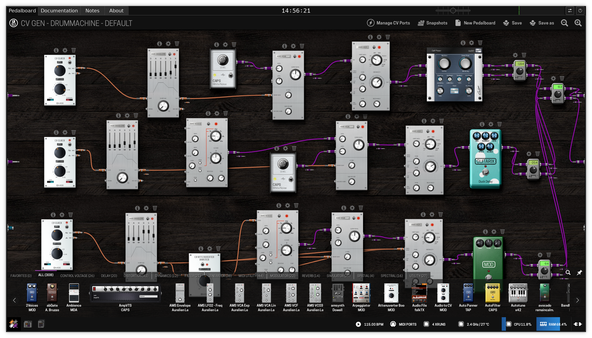

# mod-live-usb

This is a project to create a live-usb ISO for MOD.  
It bundles all the MOD stuff in a special container, so their contents match what the regular MOD units have.  
[ArchLinux](https://archlinux.org/) with a realtime kernel is used as the base system,
with a custom welcome screen running straight after boot.

When booted up you will be presented with a list of audio interfaces/devices, just pick one and enjoy!  
It will pretty much work like a MOD device, with its plugins and pedalboards, except using your own PC. :)



## Downloads

Check the Releases section for downloads, or use the Actions for "nightly" builds.  
You can flash the ISO file in the usual way via [Etcher](https://www.balena.io/etcher/) or directly with `dd`. Both methods will work.

## Building

There is a Makefile on the root folder which goes step by step for building mod-os, plugins, the welcome tool and finally the ISO.  
You will need docker installed in order to build your own ISO.

There is no support for custom builds, you are on your own if you want to build it yourself.  
Feel free to have a look at the GitHub CI stuff for how the automated build is setup,
though it is mostly just using the Makefile and caching between steps.

For local development and testing, you can build individual targets, pretty easy with make:

```sh
# build mod-os image (through docker and mod-plugin-builder)
# NOTE: takes a very long time!
make mod-os

# build plugins
# NOTE: takes a very long time!
make plugins
```

## Local usage

After `mod-os` and `plugins` targets are built we can start the special container in a similar fashion to the live-usb system. (requires root)  
For example starting with USB card:

```sh
# start with default args
./mod-os/start.sh Rubix22

# can also use extra args for samplerate and buffersize, in that order
./mod-os/start.sh Rubix22 48000 128
```

Alternatively, use can use the ALSA dummy card. (requires root)

```sh
# activate snd-dummy if not done yet
modprobe snd-dummy hrtimer=1 pcm_devs=1 pcm_substreams=1

# start in dummy mode
./mod-os/start-dummy.sh 
```

Or if you prefer you can use JACK net stuff, connecting with 29000 UDP port

```sh
# start jack server using `jackd -d net -p 29000 ...`
./mod-os/start-dummy.sh
```

### Stoppping

These containers are run through `systemd-nspawn`.  
You can terminate them by typing `^]` 3 times.

### live-welcome

The next step for local usage is to start the welcome GUI tool.

If you have not build it yet, do that first:

```sh
make -C live-welcome
```

Once built, just start it using the local usage script.  
This will connect to the container started on the previous step.

```sh
./live-welcome/mod-live-usb-welcome.local
```
